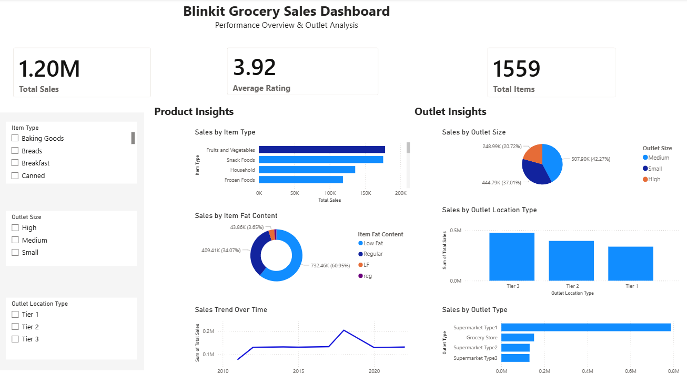

# Blinkit-Sales-Dashboard
Power BI dashboard analyzing grocery sales performance and outlet insights
# Blinkit Grocery Sales Dashboard 📊

## 📌 Project Overview
This Power BI dashboard analyzes grocery sales data to provide insights into product performance and outlet distribution.

## 📊 Key Features
- Total Sales, Average Rating, Total Items (KPI Cards)
- Sales by Item Type
- Sales by Fat Content
- Sales by Outlet Size and Location
- Sales Trend Over Time

## 📷 Dashboard Preview

## 🛠 Tools Used
- Power BI
- Data Visualization
- Data Analysis

## 📈 Insights
- Fruits & Vegetables generate the highest sales
- Low-fat items dominate product sales
- Tier 3 outlets contribute the most revenue
- Supermarket Type 1 leads in sales

## 📂 Files Included
- Blinkit-Sales-Dashboard.pbix
- dashboard.png
